# [sushi-shop](https://sushi-shop.azurewebsites.net/)

This personal project is a sushi store where the core business functions of online stores have been implemented. The goal for this project was to learn how to create a React application using TypeScript, Redux Toolkit, and several other technologies.

[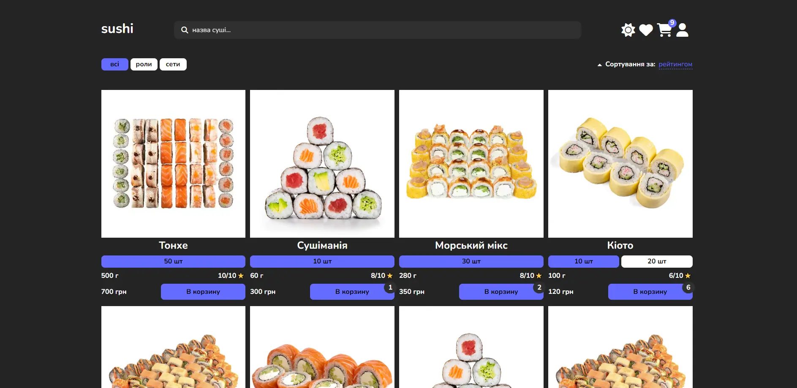](https://sushi-shop.azurewebsites.net/)

## Tech Stack

- **Client Framework:** [React](https://react.dev/)
- **Server Framework:** [Express.js](https://expressjs.com/)
- **Styling:** [Sass](https://sass-lang.com/)
- **ODM:** [Mongoose](https://mongoosejs.com/)
- **State Management:** [Redux Toolkit](https://redux-toolkit.js.org/)
- **Server Auth Management:** [PassportJS](https://www.passportjs.org/)
- **Database:** [MongoDB](https://www.mongodb.com/)

## Features to be implemented

- [x] Authentication flow using sessions created with **[PassportJS](https://www.passportjs.org/)** and **[RTK Query](https://redux-toolkit.js.org/rtk-query/overview)**
- [x] Using **[RTK Query](https://redux-toolkit.js.org/rtk-query/overview)** on the client
- [x] Containerize an application using **[Docker](https://www.docker.com/)**

## Running Locally with Docker

1. Clone the repository

   ```bash
   git clone https://github.com/EDMIGHT/sushi-shop
   ```

2. Copy the `.env.example` to `.env` and update the variables **(relative to root)**.

   ```bash
   cd server
   cp .env.example .env
   ```

3. Copy the `.env.example` to `.env` and update the variables **(relative to root)**.

   ```bash
   cd client
   cp .env.example .env
   ```

4. Running a container **(relative to root)**

   ```bash
   docker compose up -d
   ```

## Running Locally

1. Clone the repository

   ```bash
   git clone https://github.com/EDMIGHT/sushi-shop
   ```

2. Install dependencies to server folder **(relative to root)**

   ```bash
   cd server
   yarn
   ```

3. Copy the `.env.example` to `.env` and update the variables **(server folder)**.

   ```bash
   cp .env.example .env
   ```

4. Start the development server **(server folder)**

   ```bash
   yarn dev
   ```

5. Install dependencies to client folder **(relative to root)**

   ```bash
   cd client
   yarn
   ```

6. Copy the `.env.example` to `.env` and update the variables **(client folder)**.

   ```bash
   cp .env.example .env
   ```

7. Start the development server **(client folder)**

   ```bash
   yarn dev
   ```

## How do I deploy this?

- **The application is hosted on:** [Microsoft Azure](https://azure.microsoft.com/en-us)
- **The database is hosted on:** [MongoDB Atlas](https://www.mongodb.com/atlas/database)
- **Media files are hosted on:** [Cloudinary](https://cloudinary.com/documentation/node_integration)

## Known, yet unresolved issues

1. I couldn't find a proper way to add ENV variables to the client-side during container build since, for security reasons, Vite prohibits doing so. This results in the inability to specify the API address to which requests should be sent without predefining it in .env in advance

## License

Licensed under the MIT License. Check the [LICENSE](./LICENSE.md) file for details.

## More about applications

- [Catalog and work with it](#catalog-and-work-with-it)
- [Product specific page](#product-specific-page)
- [A wish list](#a-wish-list)
- [Cart and working with it](#cart-and-working-with-it)
- [Profile and work with orders](#profile-and-work-with-orders)
- [Authorization and registration](#authorization-and-registration)

## Project demo

### Catalog and work with it

The catalog consists of 8 sushi, the list of which can be scrolled through using the pagination below. Also, if the sushi has no reviews, then its rating value will be visually displayed as "new". When choosing one of the sushi options, its parameters will be changed, including: picture, price, weight.

#### Search by catalog

The search is not strict and occurs only by name. Also, to ensure less load on the server, a debounce was added using the [lodash debounce library](https://www.npmjs.com/package/lodash.debounce)
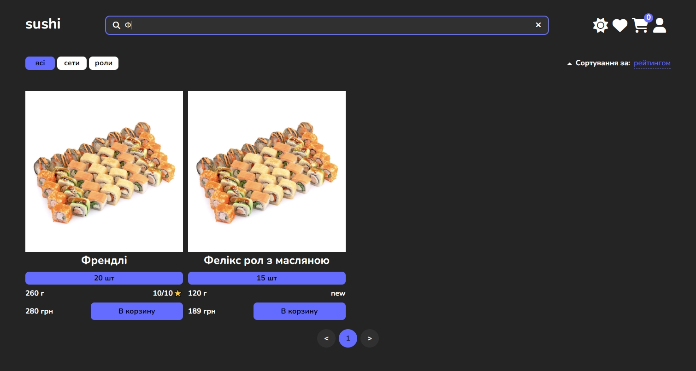

#### Catalog sorting

Sorting such as rating is based on the average rating among the reviews of this sushi.

Price sorting is based on the minimum price of the sushi variation


#### Filter by category


#### Mobile adaptation


#### Light theme


[Back to contents ⬆](#more-about-applications)

### Product specific page

A special sushi page provides exactly the same functionality as in the catalog, namely: adding a certain amount of a certain variation of sushi to the cart, adding to the wish list (if the user is authorized) and is complemented by the functionality of viewing reviews and creating a review (if the user is authorized). The review itself is added as not to a variation of sushi, but to the product as a whole.

#### With an authorized user


#### With an unauthorized user


#### Mobile adaptation


#### Light theme


[Back to contents ⬆](#more-about-applications)

### A wish list

#### Adding and removing from a wish list

Adding to the wishlist is possible only for authorized users, namely by hovering the cursor over a product in the catalog or on the personal page of the product, and there are such states where a filled heart means the presence of a wishlist in the wishlist, and not a filled-in absence:


#### Wishlist page

From the wish list page, following the same principle as described above, we can remove added sushi, but not add
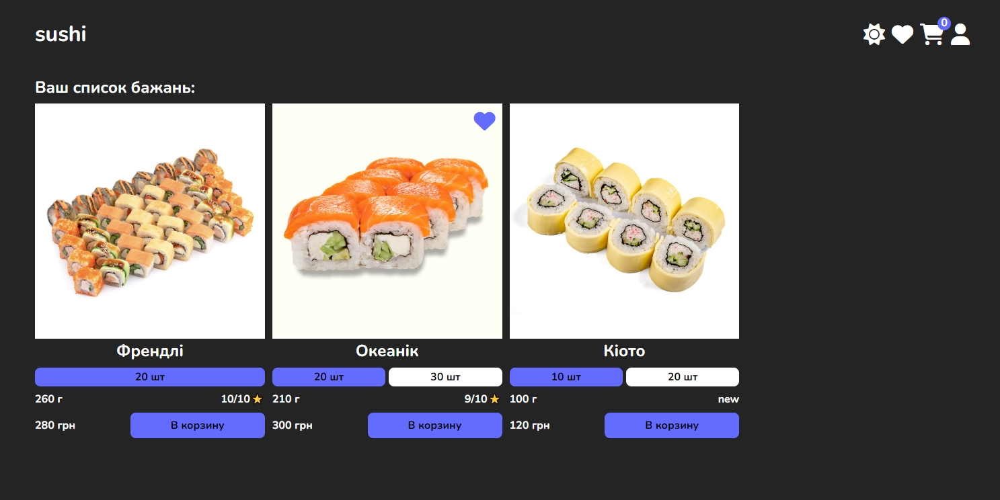

[Back to contents ⬆](#more-about-applications)

### Cart and working with it

Adding is a local state, therefore this operation can be performed by both an authorized and unauthorized user, this state is also saved at the Local Storage level and therefore will be relevant even after a reboot.

#### Add to cart

The number of items added is displayed next to the cart icon in the menu and depends on the number of sushi added, and not on the number of different types of sushi added


#### Cart Page

On this page, you can see the total cost of the order, clear it, and also change the amount of sushi of those options that we have already added to the basket (the total price is only a visual part and on the server side it will be calculated as the final one)

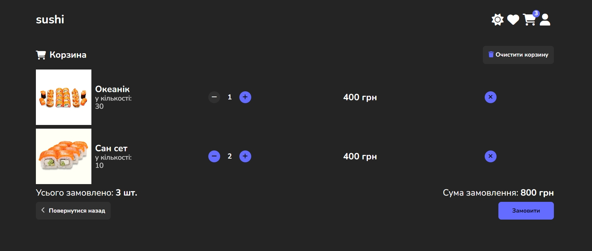

if there were no items added to the cart, the following page will be displayed:
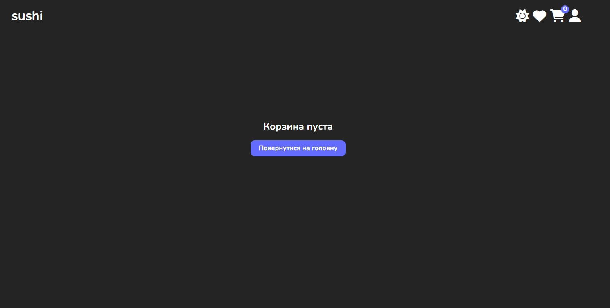

#### Mobile adaptation


#### Light theme

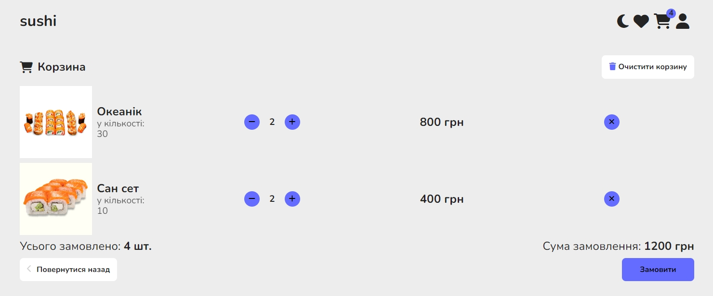

[Back to contents ⬆](#more-about-applications)

### Profile and work with orders

This page is a private route and if an unauthorized user tries to access it, it will be redirected to the main one. On this page, the user can log out of the account, see their orders, and interact with them

#### Profile Page

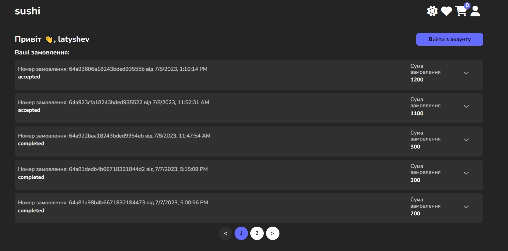

#### Order interaction

We can also expand the order by clicking the arrow at the end of it to see the contents of this order, as well as the buttons for managing it. An order has 2 statuses, namely as accepted and as completed.

When creating an order, the status automatically becomes accepted and the user in the list of orders can either mark it as completed or cancel it, which will be tantamount to deleting it. Interaction ceases to be available after the order becomes Confirmed, that is, it is no longer possible to cancel after its execution

Unconfirmed order:


Confirmed order:

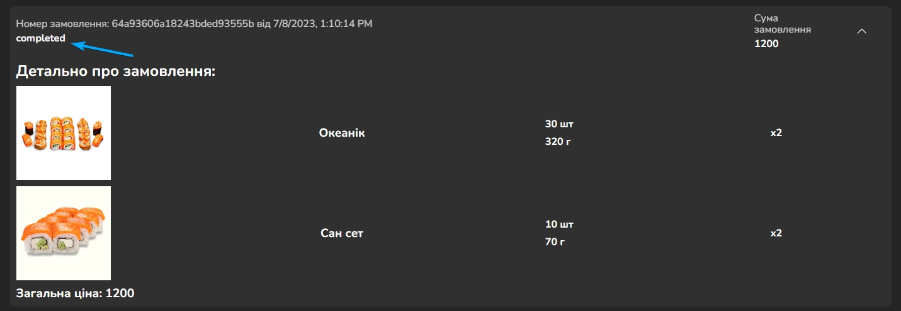

#### Mobile adaptation

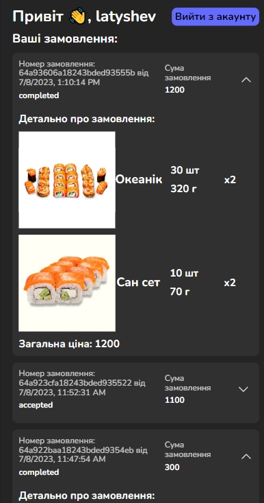

#### Light theme

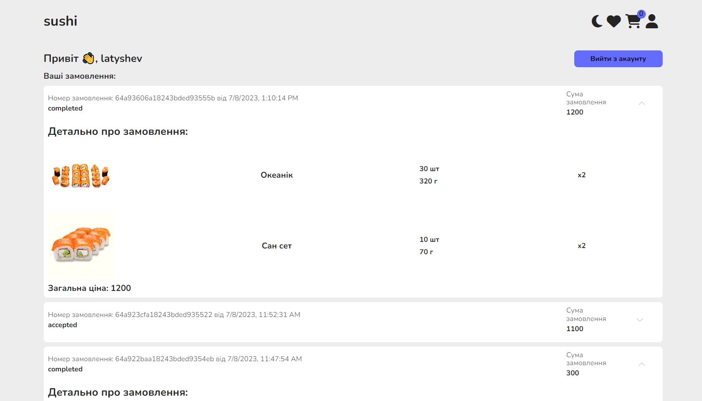

[Back to contents ⬆](#more-about-applications)

### Authorization and registration

Authorization occurs with the help of PassportJS technology, namely its local strategy using sessions. And during registration, the Bcrypt technology was used to encrypt passwords, as well as verify them during authorization

#### Pages

In the menu above, an unauthorized user must press the Sign In or Sign Up button, after which he will be redirected to the appropriate page from where he can return to the main or alternative option for the selected action (in case of authorization, the alternative is registration)

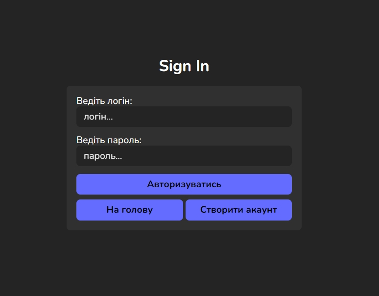


#### Validation

Form validation occurs both using standard React Hook Form tools and on the server side using express validators.
The validation itself consists of checking for an empty field, as well as for the minimum number of characters, for the login it is 2 characters, and for the password 5 and for the name it is also 2 characters

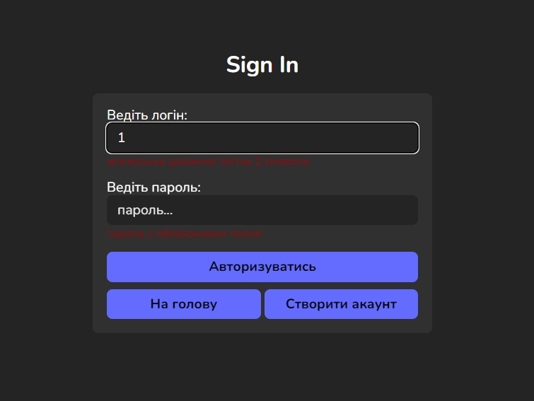
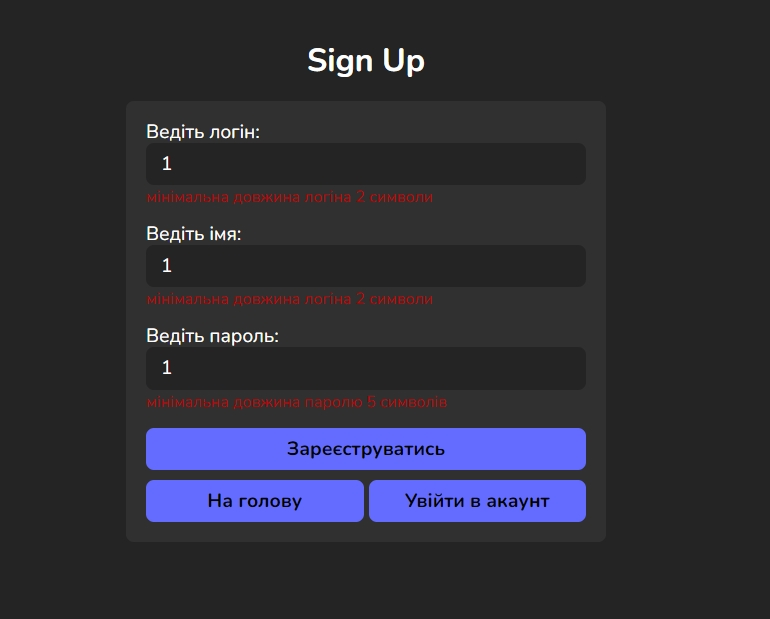

#### Mobile adaptation

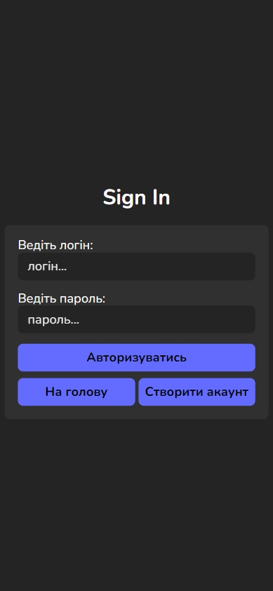
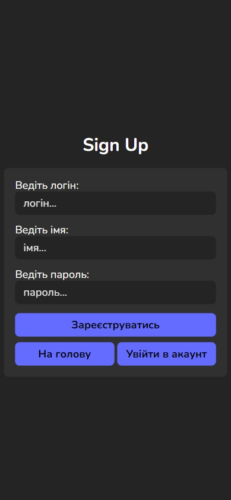

#### Light theme


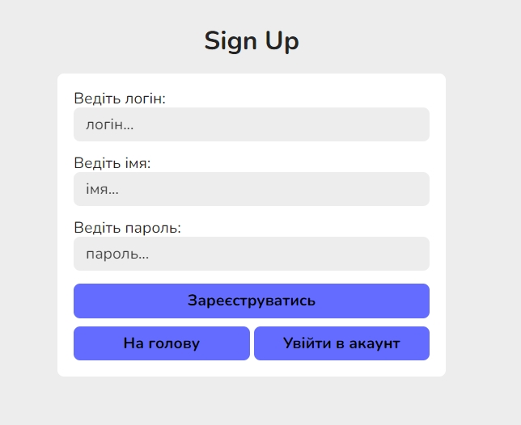

[Back to contents ⬆](#more-about-applications)
